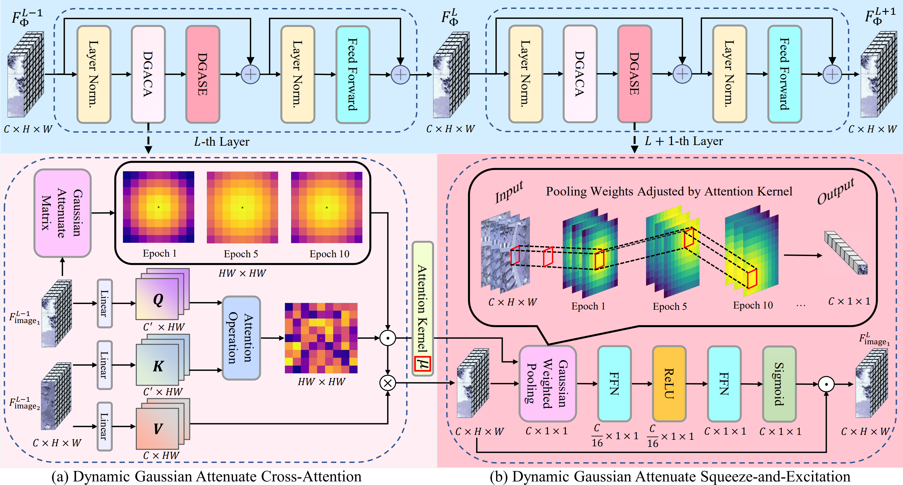
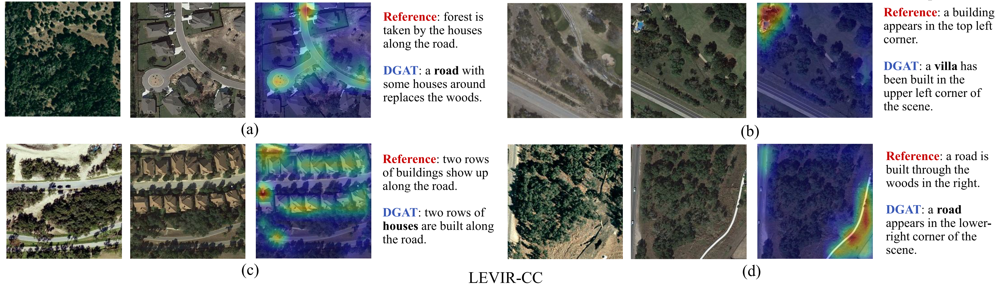
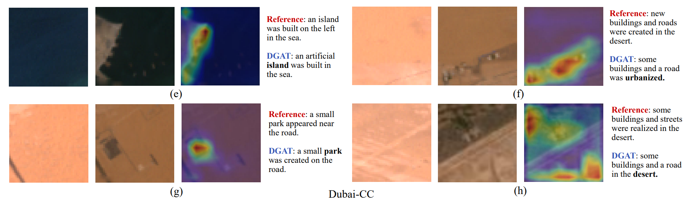
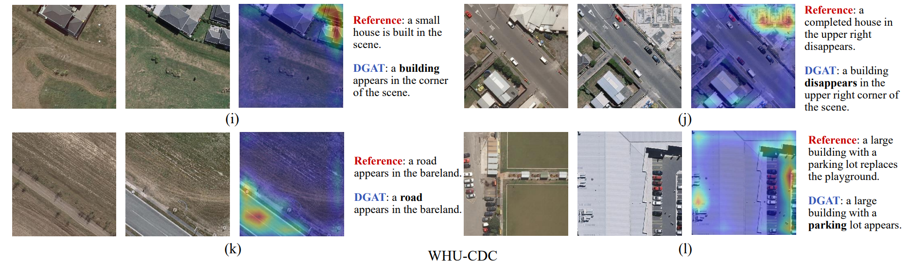

<h1 align="center">DGAT: Dynamic Gaussian Attenuate Transformer for Remote Sensing Image Change Captioning</h1>

<div align="center">

[](https://ieeexplore.ieee.org/document/11289563)

**[Pengfei Qin](https://scholar.google.com/citations?user=anNMbdMAAAAJ&hl=en), [Junmin Liu*✉](https://scholar.google.com/citations?user=C9lKEu8AAAAJ&hl=en), Lanyu Li, Chao Tian, and [Xiangyong Cao](https://scholar.google.com/citations?user=IePM9RsAAAAJ&hl=en)**



</div>

## 🚀 Preparation
#### 1. Environment Installation

- Creating a completely new virtual environment.

```bash
# 1. Create a new conda environment
conda create -n DGAT python=3.9
 
# 2. Activate the environment
conda activate DGAT

# 3. Install PyTorch 
pip install torch==2.0.1 torchvision==0.15.2 torchaudio==2.0.2 --index-url https://download.pytorch.org/whl/cu118

# 4. Install other dependencies
pip install -r requirements.txt
```

#### 2. Data Preparation

- Download the RSICC datasets such as [LEVIR-CC](https://github.com/Chen-Yang-Liu/RSICC), [Dubai-CC](https://disi.unitn.it/~melgani/datasets.html) and [WHU-CDC](https://huggingface.co/datasets/hygge10111/RS-CDC/tree/main). 
(Note that the data structure of Dubai-CC dataset should be adjusted to make it consistent with LEVIR-CC and WHU-CDC dataset, so as to facilitate the uniformity of subsequent codes.)

- The data structures of the three datasets are as follows:
```
├─/DGAT/data/LEVIR_CC (or Dubai-CC and WHU-CDC)/
        ├─captions.json
        ├─images
             ├─train
             │  ├─A
             │  ├─B
             ├─val
             │  ├─A
             │  ├─B
             ├─test
             │  ├─A
             │  ├─B
```
where folder A and folder B store the images of two different moments.


- Preprocess the text data:

```
$ python preprocess_data.py
```

## 🤖 Training
- After the environmental dependencies and the data are ready, we can start the training process:
```
$ CUDA_VISIBLE_DEVICES=0 python train.py
```

## ✅ Testing
- After the model training is completed, we can use the test set to evaluate various metrics:
```
$ CUDA_VISIBLE_DEVICES=0 python test.py
```


## 🔭 Visual Examples

Here are some visualized examples of the generated captions from LEVIR-CC, Dubai-CC and WHU-CDC datasets:






## ❤️ Acknowledgement

This repository is mainly based on [Change-Agent](https://github.com/Chen-Yang-Liu/Change-Agent), [SFT](https://github.com/sundongwei/SFT_chag2cap/tree/master) and [Chg2Cap](https://github.com/ShizhenChang/Chg2Cap). We sincerely appreciate the authors for their open-source codes.

## 📝 Citations
Please kindly cite us if our work is useful for your research.
```
@ARTICLE{dgat,
  author={Qin, Pengfei and Liu, Junmin and Li, Lanyu and Tian, Chao and Cao, Xiangyong},
  journal={IEEE Transactions on Geoscience and Remote Sensing}, 
  title={DGAT: Dynamic Gaussian Attenuate Transformer for Remote Sensing Image Change Captioning}, 
  year={2025},
  volume={63},
  number={},
  pages={1-16},
  keywords={Transformers;Attenuation;Visualization;Feature extraction;Correlation;Remote sensing;Encoding;Semantics;Kernel;Computational modeling;Attenuate mechanism;change captioning;channel attention;remote sensing;Transformer},
  doi={10.1109/TGRS.2025.3641926}}
```

## 🔏 License
This repo is distributed under [MIT License](https://github.com/Pengfei1005/DGAT/blob/main/LICENSE.txt). The code can be used for academic purposes only. 