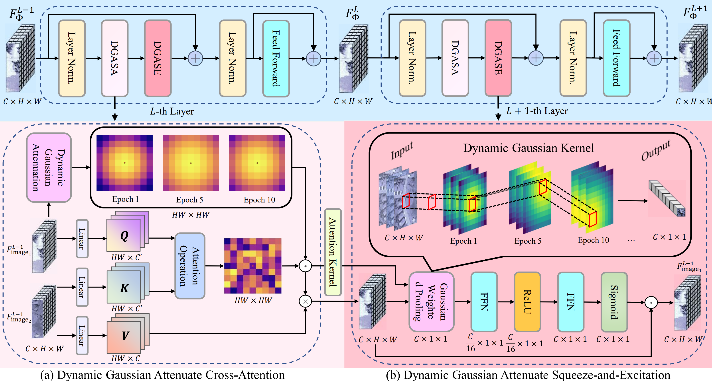

<h1 align="center">DGAT: Dynamic Gaussian Attenuate Transformer for Remote Sensing Image Change Captioning</h1>

**[Pengfei Qin](https://github.com/Pengfei1005), [Junmin Liu*✉](https://scholar.google.com/citations?user=C9lKEu8AAAAJ&hl=en), [Lanyu Li], [Chao Tian], and [Xiangyong Cao](https://scholar.google.com/citations?user=IePM9RsAAAAJ&hl=en)**



    
This is the official PyTorch implementation of DGAT: Dynamic Gaussian Attenuate Transformer for Remote Sensing Image Change Captioning.
<!-- a project conducted at the [Institute of Advanced Research in Artificial Intelligence (IARAI)](https://www.iarai.ac.at/). -->


### Preparation
- Install the required packages: `pip install -r requirements.txt`
- Download the remote sensing change captioning datasets. We have adopted [LEVIR-CC](https://github.com/Chen-Yang-Liu/RSICC), [Dubai-CC](https://disi.unitn.it/~melgani/datasets.html) and WHU-CDC in this repository. !!!NOTE!!! that if you want to use Dubai-CC, first use ``dubai_process.ipynb`` to adjust the data structure of Dubai-CC dataset.
- The data structures of the two data sets are as follows:

```
├─/root/Data/LEVIR_CC (or Dubai-CC and WHU-CDC)/
        ├─captions.json
        ├─images
             ├─train
             │  ├─A
             │  ├─B
             ├─val
             │  ├─A
             │  ├─B
             ├─test
             │  ├─A
             │  ├─B
```
where folder A contains images of pre-phase, folder B contains images of post-phase.

- Extract text files for the change descriptions of each image pair in the dataset:

```
$ python preprocess_data.py
```

### Training
- Ensure you have completed the data preparation steps above, and then proceed to train the model as follows:
```
$ python train.py
```

### Testing
- After training step, to test the accuracy on test dataset as follows:
```
$ python test.py
```
You can modify ``--checkpoint`` to use your own model or download our pretrained model ``LEVIR_CC.pth``, ``Dubai_CC.pth`` and ``WHU-CDC.pth`` from [[Google Drive](https://drive.google.com/drive/home)].

### Caption Generation
- To generate captions, run the following command:
```
$ python caption.py
```
Again, you can modify ``--checkpoint`` to use your own model or download our pretrained model.

### Visual Examples


Here are some visualized examples of the generated captions in LEVIR-CC, Dubai-CC and WHU-CDC datasets:


### Acknowledgement

- The authors would like to thank the contributors to the [LEVIR-CC](https://github.com/Chen-Yang-Liu/RSICC/tree/main) and [Dubai-CC](https://disi.unitn.it/~melgani/datasets.html) datasets.
- The authors would like to thank the work [Change-Agent](https://github.com/Chen-Yang-Liu/Change-Agent), [SFT](https://github.com/sundongwei/SFT_chag2cap/tree/master).

### License
This repo is distributed under [MIT License](https://github.com/ShizhenChang/Chg2Cap/blob/main/LICENSE.txt). The code can be used for academic purposes only.
